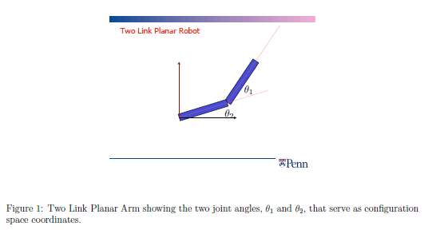
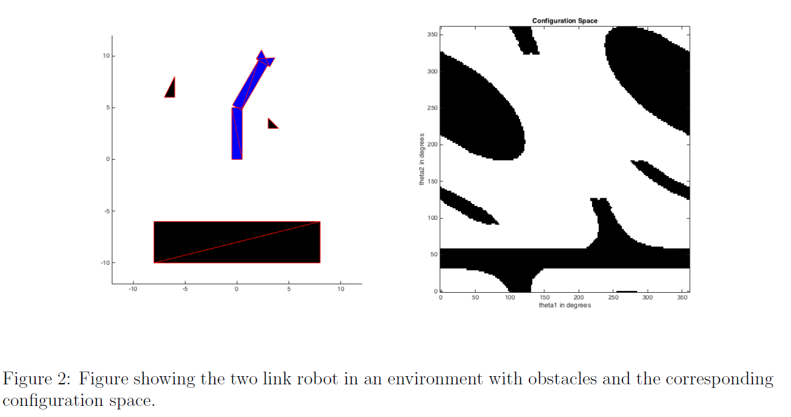
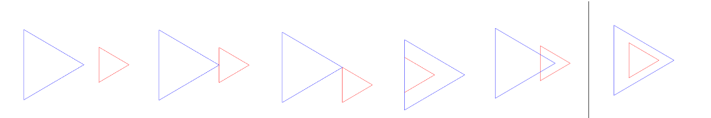

# Configuration Space: Part 1 of 2

### INTRODUCTION

The primary objective of the Configuration Space programming assignment is to provide the students with experience in practical application of Configuration Space usage in real world environments.  In this programming assignment, you will be writing a program to help guide a two link robotic arm from one configuration space to another while avoiding obstacles in the workspace. The purpose of this assignment is to provide you with some experience working with representation of configuration space. The configuration of the robot is captured by two joint angles,  and , as shown in Figure 1. These angles are represented with values between 0 to 360 degrees.



In Figure 2, the left image shows a graph depicting the robot and the workspace obstacles and the right image shows a plot of the corresponding configuration space (White) and configuration space obstacles (Black). The horizontal and vertical axes correspond to  and  respectively. In the left graph, both the robot and the obstacles are represented by a collection of triangles. This decomposition of the robot (and obstacles) into triangles helps us in deciding if a particular robotic configuration would lead to a collision or not, by checking whether any of the triangles in the robot intersect any of the triangles in the obstacles.



### INTERSECTION OF TRIANGLES

For this particular assignment, since the robotic arm and the obstacles are assumed to be a collection of triangles, any form of real world collision is simplified to the fact of intersection between the triangles of the robotic arm and the obstacle.
One of the many approaches towards understanding this concept is to consider all the 6 edges (3 for each triangle) and whether they act as separating lines where all verticesof one triangle lie on one side and all vertices of other triangle on the other side.
Also, the possible scenarios to check for are as follows:

Moving from left to right, the possible scenarios include:

1) Non intersecting triangles
2) Triangles intersecting at a single point (one line - one point)
3) Triangles intersecting at a single point (one point - one point)
4) Triangles intersecting via line overlap
5) Triangles intersecting at multiple points
6) One triangle overlapping the other



FUNCTION DESCRIPTION
For this part of the assignment you have to create the function triangle_intersection with the following input and output arguments:
P1, P2: a 3x2 array (each), describing the vertices of a triangle, where the first column represents x coordinates and the second column represents y coordinates.
flag: Return value for the function, set to true if determines intersection (including overlapping) between triangles and false otherwise.
Once completed, you can try out multiple scearios to check if your algorithm works for all cases as discussed above.

```matlab
function flag = triangle_intersection(P1, P2)
    % triangle_test : returns true if the triangles overlap and false otherwise    %%% All of your code should be between the two lines of stars.
    % *******************************************************************
    % if all x in p2 is > than all x in p1 no intersection
    % of all y in p2 is > than all y  in p1 no intersection . other wise there are intersection
    % Initialize flag as false.
    flag = false;    % Check for intersection
    % If all x-coordinates of P2 are greater than the maximum x of P1, no intersection.
    if all(P2(:, 1) > max(P1(:, 1))) || all(P2(:, 2) > max(P1(:, 2)))
        return;
    end    % If all x-coordinates of P2 are less than the minimum x of P1, no intersection.
    if all(P2(:, 1) < min(P1(:, 1))) || all(P2(:, 2) < min(P1(:, 2)))
        return;
    end    % Otherwise, we assume there might be an intersection.
    flag = true;
    end
```
